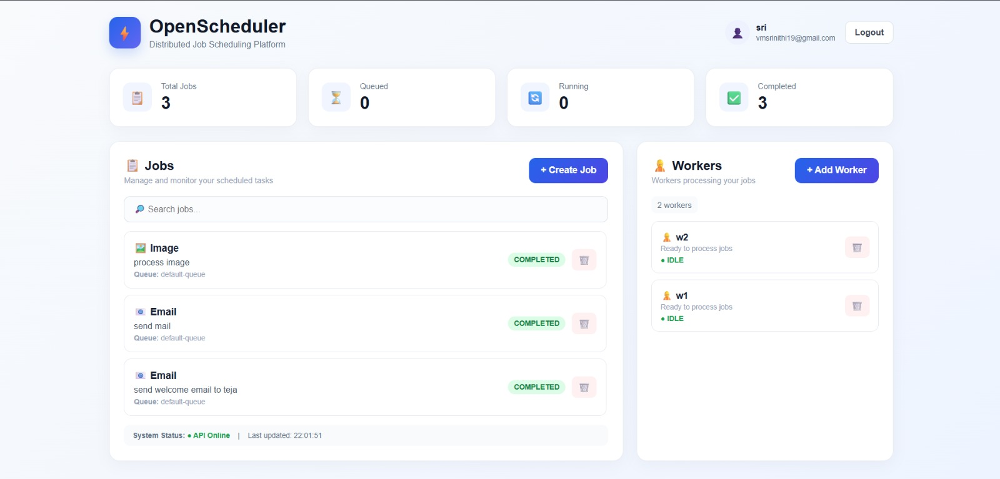
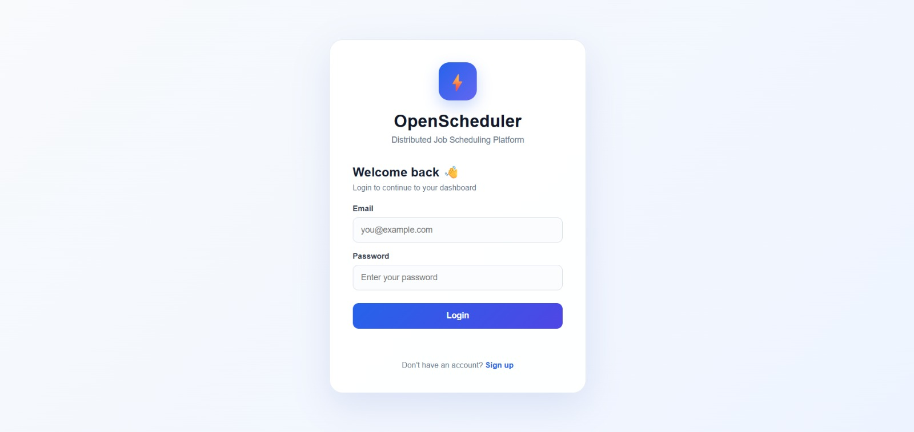

# ⚡ OpenScheduler

### Distributed Job Scheduling Platform

OpenScheduler is a distributed job scheduling platform designed to create, queue, assign, execute, and monitor background jobs through registered workers.

This project was developed as part of a college/company assessment and was taken beyond a basic local implementation by deploying the complete application with a live frontend, backend API, PostgreSQL database, and background worker execution.

---

## 🚀 Live Demo

🌐 **Frontend:**  
https://open-scheduler.vercel.app/

⚙️ **Backend API:**  
https://openscheduler-2.onrender.com

📚 **API Documentation:**  
https://openscheduler-2.onrender.com/docs

💻 **Source Code:**  
https://github.com/srinithivelu/OpenScheduler

---

## 📌 Project Overview

The goal of OpenScheduler is to demonstrate how a job scheduling system can manage tasks through queues and workers.

A user can create a job from the dashboard. The job is stored in PostgreSQL with a `QUEUED` status. A background worker continuously checks for available jobs, claims a job, executes it, and updates its status.

The execution flow is:

Job Created
     ↓
   QUEUED
     ↓
   RUNNING
     ↓
 COMPLETED
 
 ## 🖥️ Dashboard

 ### Login Page

### Dashboard

